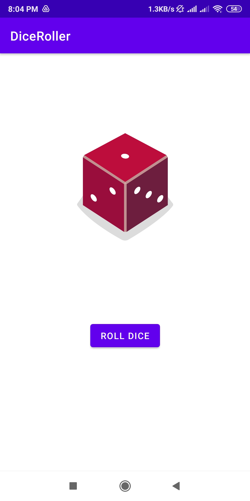

# ***DiceRoller***
## **Project Description**

---

This Project is a Simple DiceRoller app,made using kotlin language.This app was built as a submission for ***Android Study Jams 2022 at Chitkara University.***

***Android Study Jams 2022*** was a session conducted by Google Developer Student Club, in which we taught about Basics of KOTLIN language and the Dice Roller app was the Project to be submitted

# Goals

> Targets to achieve

---

- Making your First 2 Applications in 3 days
- Attain Basic Knowledge of Kotlin
- Learn Basics of Android Studio

## Specifications

> What each file does

---

- XML Files contain the Views of the application
- .kt files contain the logic
- .jpg File is the screenshot of the application
- .mp4 File is the working of the DiceRoller App
- .apk File is the apk file of DiceRoller App
## Design

> How it Looks

---

> Working
---

https://user-images.githubusercontent.com/91736425/148794345-e72da018-eddf-40e6-b326-162b97f5a689.mp4

---

