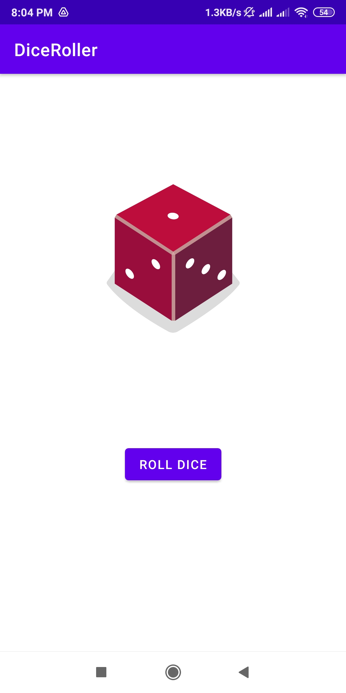

# ***DiceRoller***
## **Project Description**

---

This Project is a Simple DiceRoller app,made using kotlin language.This app was built as a submission for ***Android Study Jams 2022 at Chitkara University***

# Goals

> Targets to achieve

---

- Making your First 2 Applications in 3 days
- Attain Basic Knowledge of Kotlin
- Learn Basics of Android Studio

## Specifications

> What each file does

---

- XML Files contain the Views of the application
- .kt files contain the logic
- .jpg File is the screenshot of the application
- .mp4 File is the working of the DiceRoller App
- .apk File is the apk file of DiceRoller App
## Design

> How it Looks

---

https://github.com/guranshdeol/DiceRoller-gdsc-Workshop-Project/blob/main/2110991896-Guransh-DiceRoller-Working.mp4
---

